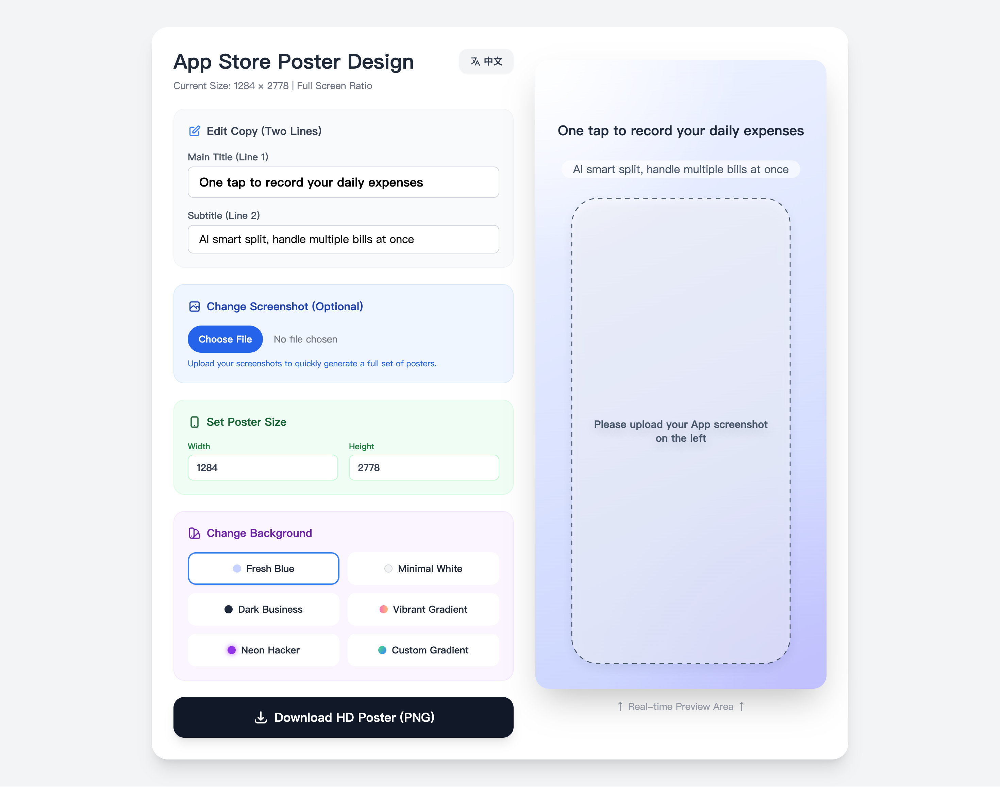

# App Store Screenshot Generator (Glassmorphism)

A lightweight, single-page web tool for generating App Store screenshots with a frosted-glass frame.



## Live Demo

- GitHub Pages: **[App Store Screenshot Generator](https://xiao-vov.github.io/App-Store-Screenshot/)**

## What it does

- Upload a screenshot
- Edit title/subtitle
- Set **custom output size** (width/height in pixels)
- Choose a background style (presets + **custom gradient**)
- Download a **high-resolution PNG** screenshot

## Privacy

Everything runs locally in your browser. Screenshots and text are **not uploaded** to any server.

## How to use

1. Open the website.
2. Upload your app screenshot.
3. Customize copy, size, and style.
4. Click **Download HD Screenshot (PNG)**.

## Run locally (optional)

Opening `index.html` directly works, but a local static server is more reliable:

```bash
python3 -m http.server 8080
```

Then open:

- `http://localhost:8080/`

## Notes

- You may see a console warning about Tailwind CDN (`cdn.tailwindcss.com should not be used in production`). This project uses the CDN for simplicity.

---

## App Store 截图生成器（毛玻璃风格）

一个轻量的单页网页工具，用于快速生成带毛玻璃相框的 App Store 截图（用于商店展示）。

## 在线地址

- GitHub Pages：**（把这里替换成你的链接）**

## 功能

- 上传截图
- 编辑主标题/副标题
- 自由设置导出尺寸（宽/高像素）
- 多套背景预设 + 支持自定义渐变
- 一键导出高清 PNG 截图

## 隐私说明

所有处理都在浏览器本地完成，截图和文案**不会上传到服务器**。

## 使用方法

1. 打开网页
2. 上传 App 截图
3. 调整文案、尺寸、背景样式
4. 点击“下载高清截图 (PNG)”

## 本地运行（可选）

直接双击打开 `index.html` 通常也能用；如果遇到浏览器限制，推荐起一个静态服务器：

```bash
python3 -m http.server 8080
```

然后访问：

- `http://localhost:8080/`

## 备注

- 控制台可能提示 Tailwind CDN 的生产环境警告，这是正常的（为了简单直接使用 CDN）。
